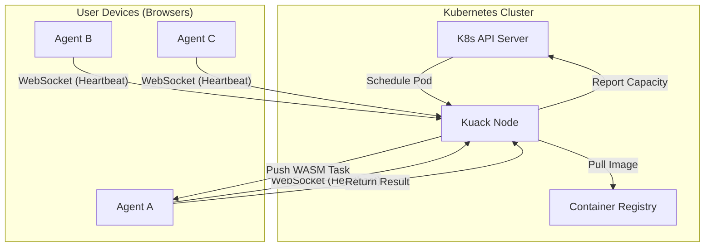

# Architecture overview

Kuack bridges the gap between the Kubernetes Control Plane and the browser runtime. It allows you to treat a fleet of web browsers as a single, powerful Kubernetes Node.

## High-Level Overview

The system consists of three main components:

1. **Kuack Node (Virtual Kubelet):** A pod running in your cluster that masquerades as a Kubernetes Node.
2. **Kuack Agent:** A lightweight JavaScript library running in the user's browser.
3. **Workload (WASM):** Your application code, compiled to WebAssembly and packaged as an OCI container.

## Component Breakdown

### 1. Kuack Node (The Brain)

The Node is a Go application implementing the [Virtual Kubelet](https://virtual-kubelet.io/) interface.

- **Resource Aggregation:** It accepts WebSocket connections from Agents. It sums up their available CPU and Memory and reports this total capacity to Kubernetes.
- **Pod Scheduling:** When Kubernetes schedules a Pod to the Kuack Node, the Node intercepts the request.
- **Image Extraction:** Instead of running a Docker container itself, the Node pulls the specified image from the registry. It extracts the WebAssembly binary layer from the multi-platform image.
- **Task Distribution:** The Node selects a suitable connected Agent and sends the WASM binary to it for execution.

### 2. Kuack Agent (The Worker)

The Agent is a small TypeScript library that runs on the client side.

- **Connection:** Establishes a persistent WebSocket connection to the Node.
- **Profiling:** Detects available hardware concurrency (CPU cores) and memory.
- **Runtime:** When it receives a task, it instantiates a WebAssembly runtime environment. It executes the binary, capturing `stdout` and `stderr`.
- **Streaming:** Logs and results are streamed back to the Node in real-time.

### 3. The Workload (Multi-Platform OCI Images)

Kuack leverages the standard OCI (Docker) ecosystem. You build your application once, targeting multiple architectures:

- `linux/amd64` (for standard servers)
- `linux/arm64` (for ARM servers)
- `wasi/wasm` (for Kuack/Browsers)

When you deploy, Kubernetes doesn't care where the Pod runs. If it lands on a standard server, the Linux binary runs. If it lands on Kuack, the WASM binary runs. This provides a seamless **fallback mechanism**.

#### Native WASM vs Container-to-WASM

Kuack supports two types of WASM workloads:

1. **Native WebAssembly** - Applications compiled directly to WASI/WebAssembly for optimal performance
2. **Container2wasm-converted** - Existing Linux containers converted to WASM using [container2wasm](https://github.com/container2wasm/container2wasm), enabling you to run existing containerized applications (Python, Node.js, compiled binaries, etc.) in browsers without rewriting code

Container2wasm uses CPU emulation (Bochs, TinyEMU, or QEMU) to run a full Linux kernel and container runtime inside the browser's WebAssembly sandbox. This expands what can run on Kuack, but with important limitations: only compatible containers (x86_64, riscv64, or AArch64) work, networking is limited to HTTP/WebSockets, and applications must be single-process and short-lived. See the [workload model documentation](/docs/workload-model) for detailed constraints.

## The Lifecycle of a Task

1. **User connects:** A user opens your website. The Kuack Agent connects to the Node.
2. **Capacity Update:** The Node informs K8s: "I have +4 CPUs available."
3. **Scheduling:** You run `kubectl run my-job --image=my-app`. K8s schedules it to the Kuack Node.
4. **Dispatch:** The Node pulls `my-app`, extracts the `.wasm` file, and sends it to the User's browser.
5. **Execution:** The browser runs the WASM.
6. **Result:** The output is sent back to the Node, which pipes it to the K8s logs. You see the output via `kubectl logs my-job`.
